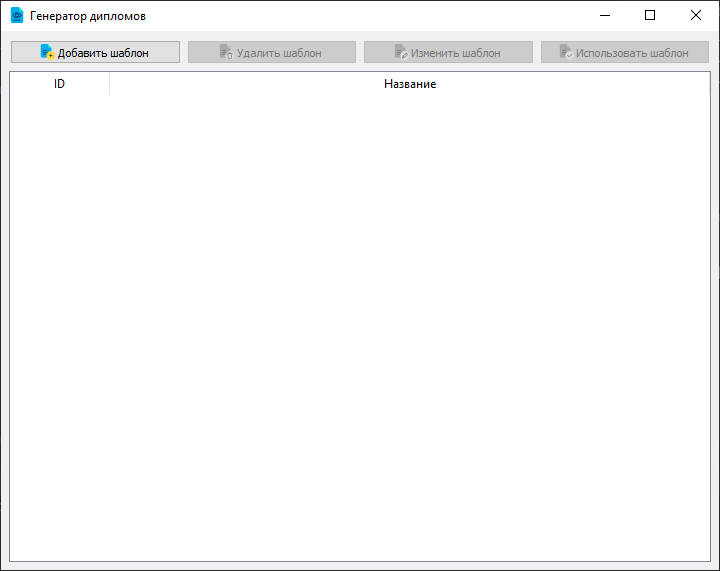
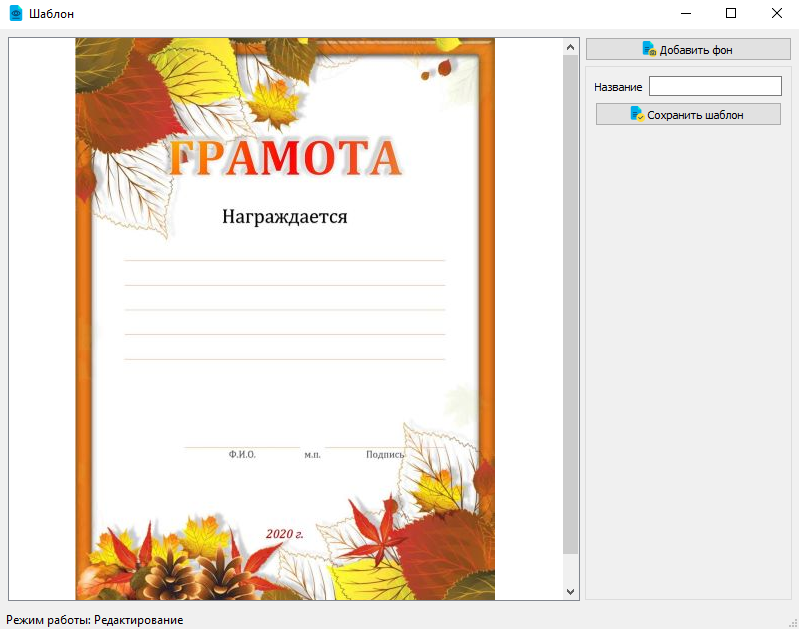
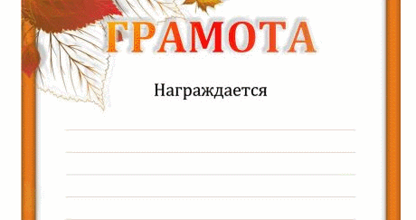
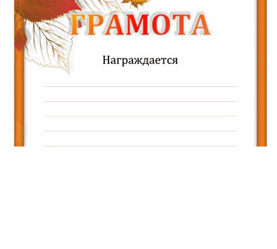
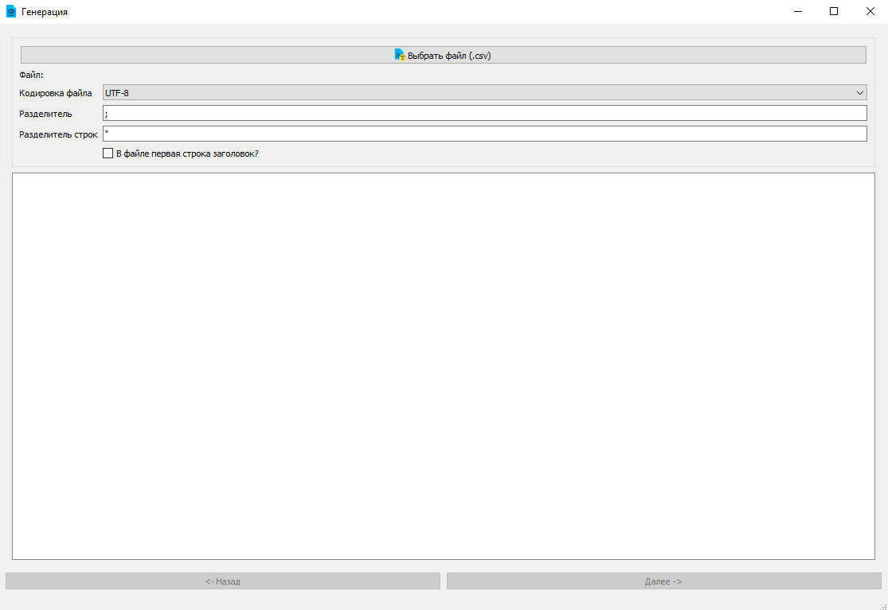
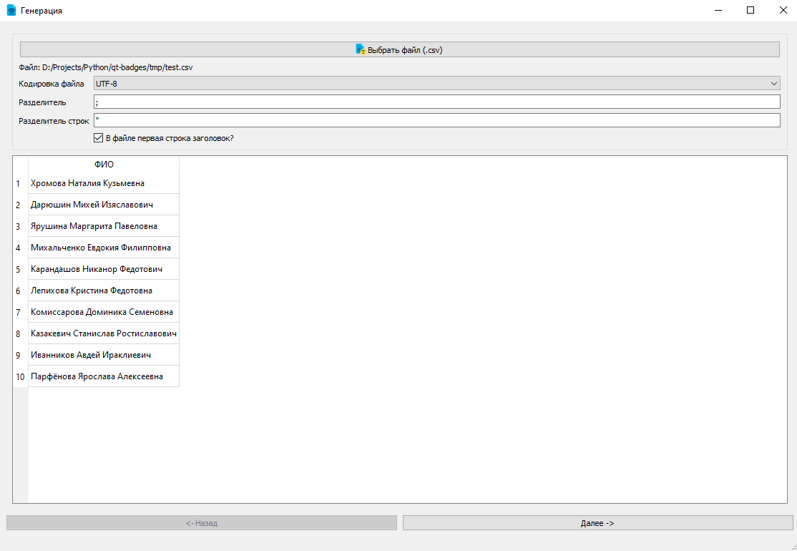
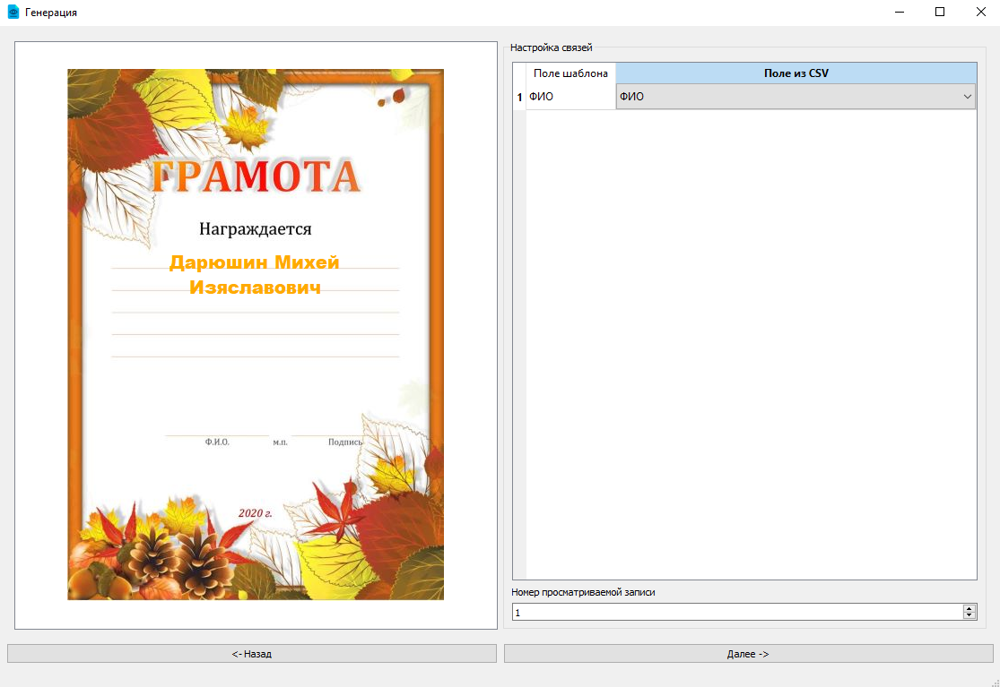
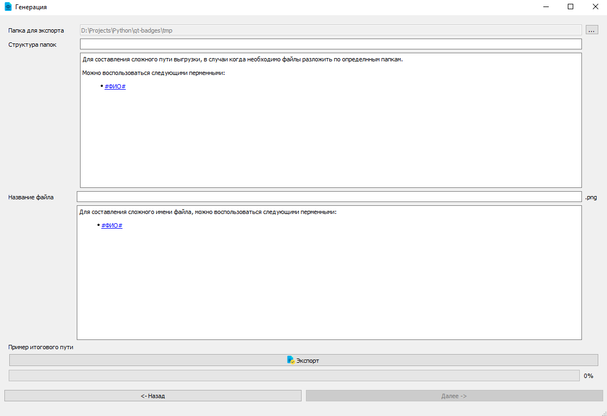
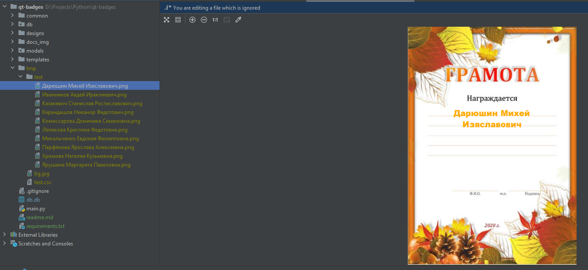

# Генератор дипломов

Проект нацелен на автоматизацию генерации благодарственных писем, дипломов, наград и т.д.
Созданные редактор шаблонов позворляет просто определить поля и свойства текста, который будет вписан в эти поля.
А режим экспорта, позволяет быстро выгрузить список файлов на основе csv файла.

## Как пользоваться
В первую очередь `pip install -r requirements.txt`
### Запускаем `main.py`
Перед вами основное окно программы, для начала необходимо добавить шаблон (если его нет).

Теперь создаем шаблон. Для начала добавьте фон (подложку, например грамоту).

После добавления фона появляется возможность сохранить шаблон (предварительно введя его название).
По умолчанию, после добавления фона, вы автоматически попадаете в режим редактирования.

### Режимы работы:
 * Режим редактирования: в данном режиме вы можете редактировать (перетаскивать, настравивать, удалять) созданные элементы на холсте.
 * Режим добавления: в данном режиме вы создаете новые элементы
 
Переключение режимов осуществляется при помощи клавиши `Ctrl`. Текущий статус можно увидеть в низу окна.

#### Режим редактирования:
В режиме редактирования доступны следующие команды:
 * Двойной `ПКМ`: открыть настроки элемента
 * `Del`: удалить элемент
 * `ЛКМ`: перемещяет элемент
 
#### Режим добавления:
В данном режиме вы создаете новые элементы, элемент - это "прямоуголник" в который позже будет вписан текст.
Для создания элемента зажмите в верхней левой точке ЛКМ, протяните в нужную сторону и на нужный размер, отпустите.

После добавления элемента настройте его, как вам нужно.

После сохранения шаблона вы вырнетесь в главное окно. В списке вы увидите свой шаблон. 
Выбрав который вы можете удалить, изменить или сгенерировать грамоты.

### Генерация по шаблону
Выбрав шаблон, нажмите кнопку "Использовать шаблон".

#### Шаг 1
Выбор `csv` файла и настройка его работы. (Пример файла `./tmp/test.csv`)

Выбранный и настроенный файл

Нажмите "Далее"
#### Шаг 2
На данном моменте необходимо сопоставить поля из шаблона и файла, а так же можно посмотреть как будет выглядеть готовый вариант.
Нажмите "Далее"

#### Шаг 3
Это финальный шаг, здесь необходимо установить название файла, путь сохранения. В пути и названии файла можно использовать поля из файла.

После всех настроек нажмите "Экспорт".

После того как процесс завершится посмотрите результат :)
